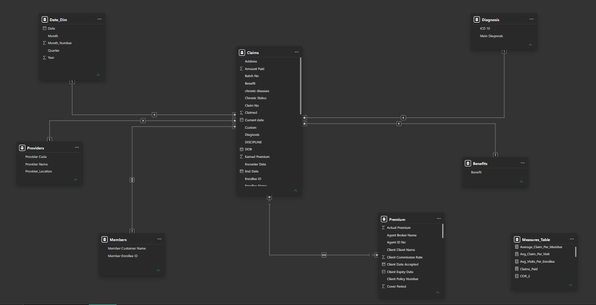
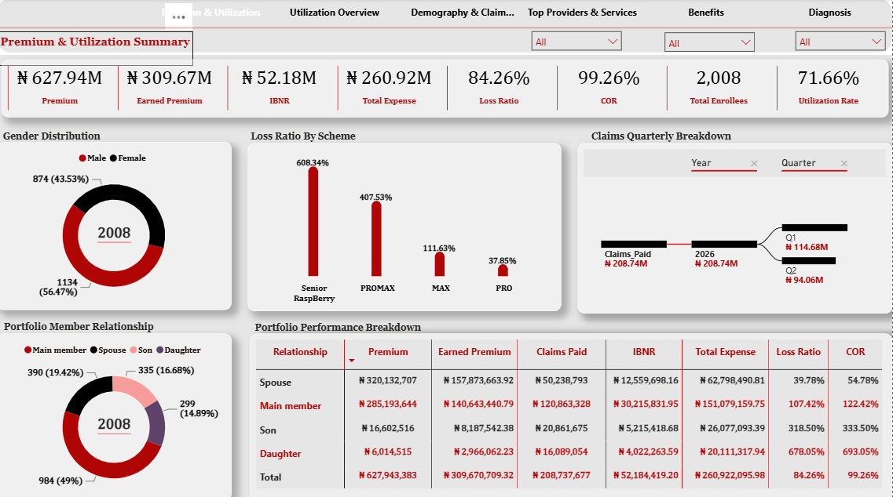
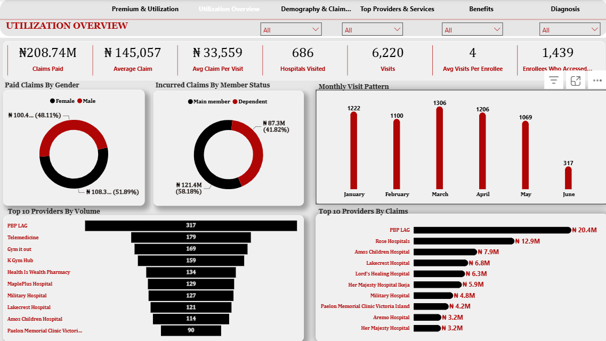
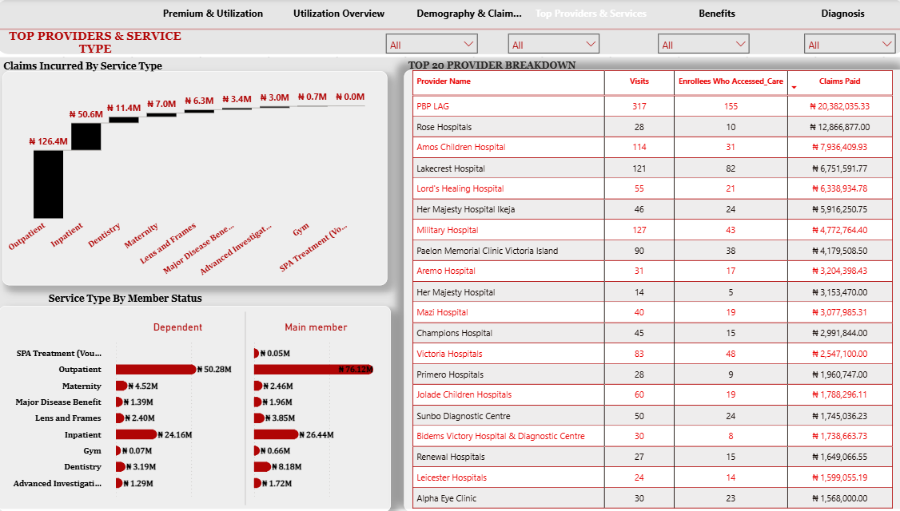
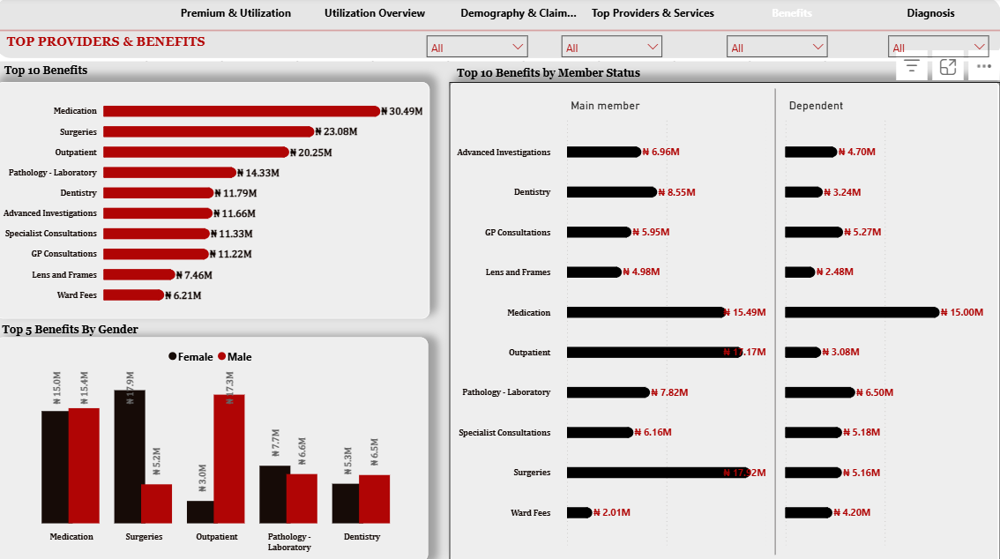
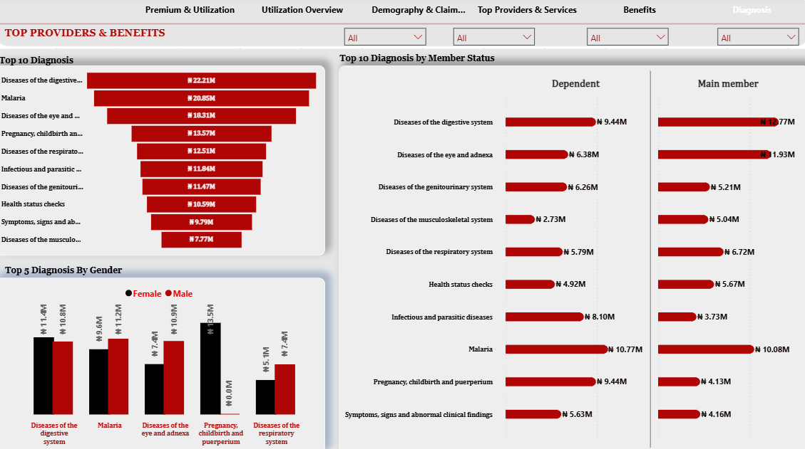

<div align="center">

# 🏥 Health Insurance Business Intelligence Dashboard
### Portfolio & Utilization Analysis for a Health Maintenance Organization (HMO)

**Turning fragmented claims, provider, and benefit data into a single source of truth for executive decision-making.**


<br>


<br><br>

**[📄 PDF Report](./documentation/Health_Insurance_Portfolio_Analysis.pdf)** · **[📊 PBIX File](./Health_Insurance_Dashboard.pbix)** · **[🖼️ Screenshots](./assets/screenshots/)** · **[✉️ Contact](#-about-the-author)**

</div>

<br>

---

## 📌 Executive Summary

Health Maintenance Organizations sit at the intersection of insurance underwriting and healthcare delivery — they carry the financial risk of a member population while depending on a network of external providers to deliver care. That dual exposure makes visibility non-negotiable: an HMO that cannot see its loss ratio, its provider concentration, and its benefit utilization in near real time is flying blind on both its underwriting book and its care network.

This project delivers a **six-page Power BI Business Intelligence solution** built to give management and stakeholders a single, governed view of portfolio performance — from premium and claims economics down to individual provider and diagnosis-level utilization. It was designed to answer the question every HMO executive eventually asks: *"Where is our risk concentrated, and what is it costing us?"*

The dashboard consolidates premium, claims, membership, provider, benefit, and diagnosis data into a modeled, relationship-driven star schema, replacing static spreadsheet reporting with an interactive, drill-down analytical layer that supports both operational monitoring and strategic decision-making.

**Business value delivered:**
- A single governed view of **premium, earned premium, claims, IBNR, loss ratio, and combined operating ratio (COR)**
- Provider-level visibility into **volume, cost, and network concentration**
- Benefit and diagnosis-level cost drivers to inform **pricing and preventive care strategy**
- Demographic and scheme-level segmentation to support **portfolio profitability analysis**

<br>

---

## 🎯 Business Challenge

Health insurance portfolios generate data across multiple, loosely connected domains — premiums, claims, provider networks, benefits, and diagnoses — each typically tracked in its own spreadsheet or system extract. For an HMO, this fragmentation creates real business risk:

| Challenge | Business Impact |
|---|---|
| **Portfolio Profitability** | Without a consolidated loss ratio and COR view, leadership cannot tell which schemes or member segments are profitable and which are eroding margin |
| **Claims Monitoring** | Claims trends (seasonality, spikes, IBNR movement) are hard to detect in static reports until they've already impacted the P&L |
| **Provider Management** | Provider cost and volume data is scattered, making it difficult to identify network concentration risk or negotiate leverage |
| **Utilization Tracking** | Manual reporting can't easily answer "how is the member population actually using their benefits?" at a granular level |
| **Benefit Analysis** | Without benefit-level cost breakdowns, plan design decisions are made on intuition rather than evidence |
| **Diagnosis Monitoring** | Disease burden and cost-by-diagnosis trends are invisible without a dedicated analytical layer, limiting preventive care planning |
| **Executive Reporting** | Recreating monthly/quarterly reports manually is slow, error-prone, and not interactive enough for exploratory questions |

**Why spreadsheets alone fall short:** Excel-based reporting typically means static snapshots, manual VLOOKUPs across disconnected files, no relationship modeling between claims/providers/benefits/diagnosis, and reports that go stale the moment new data lands. There is no drill-through, no dynamic filtering by scheme or demographic, and no single, auditable version of KPIs like Loss Ratio or COR that every stakeholder can trust. A modeled BI solution solves this by centralizing the data model once and letting every report page — and every future question — draw from the same governed source of truth.

<br>

---

## 🎯 Business Objectives

1. Consolidate premium, claims, membership, provider, benefit, and diagnosis data into a single relational data model
2. Deliver a governed, reusable definition of core insurance KPIs — **Loss Ratio, COR, IBNR, Utilization Rate** — eliminating conflicting spreadsheet calculations
3. Enable executives to monitor portfolio performance by **scheme, member relationship, gender, and age group**
4. Surface **provider concentration risk** by ranking providers on volume and claims cost
5. Quantify **benefit-level and diagnosis-level cost drivers** to inform plan design and preventive care investment
6. Reduce time-to-insight for recurring management reporting from a manual, multi-day spreadsheet process to a real-time, self-service dashboard
7. Provide a scalable data model architecture that can absorb new claim periods without rebuilding reports

<br>

---

## 🗂️ Dataset Overview

The solution is built on a relational dataset representing a full HMO claims and membership cycle. Each table plays a defined role in the overall model:

| Dataset | Description | Role in Model |
|---|---|---|
| **Premium** | Premium and earned premium figures by scheme and member relationship | Revenue side of the loss ratio / COR calculation |
| **Claims** | Individual claim transactions — amount, provider, service type, diagnosis, date | Core fact table driving claims paid, IBNR, and utilization metrics |
| **Members (Enrollees)** | Member-level demographic attributes — gender, age, relationship to main member, scheme | Dimension for demographic and scheme-based segmentation |
| **Providers** | Healthcare providers (hospitals, clinics, pharmacies, telemedicine) in the network | Dimension for provider volume/cost ranking and network analysis |
| **Benefits** | Benefit categories (Medication, Surgeries, Outpatient, Dentistry, etc.) | Dimension for benefit utilization and cost-driver analysis |
| **Diagnosis** | ICD-aligned diagnosis categories associated with claims | Dimension for disease-burden and preventive care insight |
| **Date** | Calendar table for time intelligence | Enables year, quarter, and month-level trend analysis |

<br>

---

## 🧩 Data Model

The model follows a **star schema** design: a central `Claims` fact table connected to `Members`, `Providers`, `Benefits`, `Diagnosis`, and `Date` dimension tables, with `Premium` linked at the scheme/member-relationship grain. This structure keeps every visual across all six report pages calculating from a single, consistent set of relationships rather than page-specific logic.

<div align="center">

</div>

**Why a star schema:** it minimizes redundant relationships, keeps DAX filter context predictable across pages, and scales cleanly — new claim periods or providers can be added without restructuring the model.

<br>

---

## ⚙️ Technical Architecture

| Layer | Implementation |
|---|---|
| **Data Cleaning & Transformation** | Power Query used to standardize provider names, resolve inconsistent categorical values, handle nulls, and shape tables for the model |
| **Data Modeling** | Star schema with single-direction relationships from dimensions into the `Claims` fact table |
| **DAX Measures** | A dedicated measure layer for Premium, Earned Premium, Claims Paid, IBNR, Loss Ratio, COR, Utilization Rate, and Average Claim metrics |
| **KPI Cards** | Executive-level card visuals surfacing headline metrics on every page |
| **Interactive Filtering** | Slicers for Year, Quarter, Gender, Scheme, and Member Status applied consistently across pages |
| **Navigation** | A persistent top navigation bar linking all six report pages |
| **Bookmarks & Drill-through** | Used to support guided navigation between summary and detail views (e.g., Top Providers → Provider Detail) |
| **Performance Optimization** | Star schema (vs. a flat single table) to reduce model size and improve query folding and refresh performance |

<br>

---

## 📊 Dashboard Walkthrough

<details open>
<summary><b>1️⃣ Premium & Utilization Summary (Executive Overview)</b></summary>

<br>

**Purpose:** Give leadership a one-glance view of overall portfolio health.

**Business Questions Answered:**
- What is our total premium, earned premium, and claims paid position?
- What is our current Loss Ratio and Combined Operating Ratio?
- How is claims cost distributed by member relationship and scheme?

**Key KPIs:** Premium (₦627.94M) · Earned Premium (₦309.67M) · Claims Paid (₦208.74M) · IBNR (₦52.18M) · Total Expense (₦260.92M) · Loss Ratio (84.26%) · COR (99.26%) · Total Enrollees (2,008)

**Visualizations Used:** KPI cards, quarterly claims trend, gender distribution donut, member relationship breakdown table, loss-ratio-by-scheme chart

**Business Value:** Gives executives an immediate read on portfolio profitability and whether the book is trending toward an underwriting loss (COR approaching or exceeding 100%).



</details>

<details>
<summary><b>2️⃣ Utilization Overview</b></summary>

<br>

**Purpose:** Quantify how the member population is actually consuming care.

**Business Questions Answered:**
- How many visits, providers, and enrollees are driving utilization?
- What is the average cost per claim and per visit?
- Which providers see the highest patient volume?

**Key KPIs:** Claims Paid (₦208.74M) · Average Claim (₦145,057) · Average Claim per Visit (₦33,559) · Hospitals Visited (686) · Visits (6,220) · Average Visits per Enrollee (4) · Enrollees Who Accessed Care (1,439)

**Visualizations Used:** KPI cards, Top 10 Providers by Volume bar chart, Top 10 Providers by Claims bar chart, paid claims by gender donut, incurred claims by member status, monthly visit pattern line chart

**Business Value:** Identifies which providers and service points are generating the highest utilization, supporting network management and cost-containment conversations.



</details>

<details>
<summary><b>3️⃣ Demography & Claim Trend</b></summary>

<br>

**Purpose:** Segment claims and utilization by demographic and scheme attributes.

**Business Questions Answered:**
- How does claims cost vary by scheme, age group, and member relationship?
- What are the month-over-month claims and visit trends?
- How are claims distributed geographically?

**Key KPIs:** Incurred claims by scheme, age group, relationship · monthly claims & visits trend

**Visualizations Used:** Scheme breakdown donut, age-group bar chart, member-relationship bar chart, regional claims map/chart, dual-axis claims-and-visits trend line

**Business Value:** Surfaces which demographic segments carry disproportionate claims risk (for example, the 26–35 age band shows the highest incurred claims of any age group), informing pricing and plan design by segment.


</details>

<details>
<summary><b>4️⃣ Top Providers & Service Type</b></summary>

<br>

**Purpose:** Rank the provider network by volume, reach, and cost.

**Business Questions Answered:**
- Which providers account for the largest share of claims cost?
- Which providers see the most enrollees and visits?
- How does claims cost break down by service type (outpatient, inpatient, dentistry, maternity, etc.)?

**Key KPIs:** Top 20 provider breakdown (visits, enrollees served, claims paid) · claims by service type

**Visualizations Used:** Sortable provider detail table, service-type bar chart, service type by member status stacked chart

**Business Value:** Outpatient care is the single largest service-type cost driver, followed by inpatient care — a clear signal for where cost-containment and network-negotiation efforts would have the greatest impact.




</details>

<details>
<summary><b>5️⃣ Benefits Analysis</b></summary>

<br>

**Purpose:** Break down claims cost by benefit category to evaluate plan design efficiency.

**Business Questions Answered:**
- Which benefit categories drive the most cost?
- How does benefit utilization differ by gender and member status?

**Key KPIs:** Top 10 benefits by cost (Medication, Surgeries, Outpatient, Pathology-Laboratory, Dentistry, and others) · benefit split by gender and member status

**Visualizations Used:** Top 10 benefits bar chart, top 5 benefits by gender chart, top 10 benefits by member status chart

**Business Value:** Medication and Surgeries are the two highest-cost benefit categories in the portfolio — evidence that can directly inform co-pay design, pre-authorization rules, and pharmacy benefit management strategy.




</details>

<details>
<summary><b>6️⃣ Diagnosis Analysis</b></summary>

<br>

**Purpose:** Quantify disease burden across the member population to guide preventive care strategy.

**Business Questions Answered:**
- Which diagnosis categories generate the highest claims cost?
- How does diagnosis-driven cost vary by gender and member status?

**Key KPIs:** Top 10 diagnoses by cost (led by digestive system disorders, malaria, and eye/adnexa conditions) · diagnosis split by gender and member status

**Visualizations Used:** Top 10 diagnosis bar chart, top 5 diagnosis by gender chart, top 10 diagnosis by member status chart

**Business Value:** Malaria and digestive-system conditions rank among the top cost drivers — both are meaningfully addressable through preventive health programs, giving the HMO a direct, data-backed case for investing in member wellness initiatives.



</details>

<br>

---

## 📖 KPI Dictionary

| KPI | Definition |
|---|---|
| **Premium** | Total contracted premium value for the portfolio across all schemes and member relationships |
| **Earned Premium** | The portion of written premium recognized as revenue for the period covered, after accounting for the policy's time-in-force |
| **Claims Paid** | Total value of claims that have been processed and paid out to providers or members |
| **IBNR (Incurred But Not Reported)** | Reserve estimate for claims that have been incurred but not yet reported or fully settled — a critical forward-looking liability metric |
| **Loss Ratio** | Total incurred claims cost (including IBNR) divided by Earned Premium — the core measure of underwriting profitability |
| **Combined Operating Ratio (COR)** | Loss Ratio plus the expense ratio; a COR above 100% indicates the portfolio is operating at an underwriting loss before investment income |
| **Utilization Rate** | The proportion of eligible enrollees who accessed at least one covered service in the period |
| **Average Claim** | Total claims paid divided by total number of claims — average cost per claim event |
| **Average Claim per Visit** | Total claims paid divided by total number of visits — a finer-grained cost-per-encounter measure |
| **Average Visits per Enrollee** | Total visits divided by total enrollees who accessed care — a proxy for care-seeking frequency |

<br>

---

## 💡 Business Insights

- **Provider concentration is material.** A relatively small number of hospitals and providers account for a disproportionate share of both visit volume and claims cost, indicating meaningful network concentration risk worth monitoring.
- **Member relationship segments carry very different loss profiles.** Dependents (particularly sons and daughters) show substantially higher loss ratios than main members and spouses, suggesting the dependent segment is a key driver of portfolio underperformance.
- **Outpatient care dominates the cost base**, well ahead of inpatient, dentistry, and other service types — underscoring the outsized role routine and ambulatory care plays in total spend.
- **Medication and surgical benefits are the leading cost categories**, pointing to opportunities for pharmacy benefit management and surgical case management as cost-optimization levers.
- **Malaria and digestive-system diagnoses are top cost drivers**, both of which are strong candidates for preventive health and member-engagement interventions.
- **The COR is running close to 100%**, signaling the portfolio is operating near or at underwriting breakeven — a level that typically warrants closer pricing and reserving scrutiny.
- **Utilization varies meaningfully by demographic group**, with the 26–35 age band generating the highest incurred claims of any cohort, relevant to age-banded pricing considerations.

<br>

---

## 🧭 Strategic Recommendations

1. **Provider network management** — Renegotiate rates or introduce tiered co-pays with the highest-volume, highest-cost providers to reduce concentration risk and improve unit economics.
2. **Cost control on outpatient utilization** — Introduce pre-authorization thresholds or gatekeeping for high-frequency outpatient categories driving the largest share of spend.
3. **Portfolio profitability by segment** — Reassess pricing for member-relationship segments (particularly dependents) showing elevated loss ratios relative to main members.
4. **Claims and reserve management** — Strengthen IBNR estimation discipline given its material share of total expense, to avoid reserve shortfalls.
5. **Forecasting** — Layer in trend-based forecasting for claims and utilization to support proactive, rather than reactive, budget and reserve planning.
6. **Pricing strategy** — Use age-band and scheme-level loss ratio evidence to refine premium pricing at renewal.
7. **Member engagement & preventive care** — Launch targeted wellness programs around malaria prevention and digestive-health screening, the two leading addressable diagnosis-driven cost categories.
8. **Pharmacy benefit management** — Given medication is the single largest benefit cost line, formulary management and generic-substitution policies could yield meaningful savings.

<br>

---

## 🛠️ Skills Demonstrated

| | |
|---|---|
| 📊 **Business Intelligence** | End-to-end BI solution design, from raw data to executive dashboard |
| ⚡ **Power BI** | Multi-page report design, navigation, bookmarks, drill-through |
| 🧮 **DAX** | Custom measures for insurance and healthcare-specific KPIs |
| 🔧 **Power Query** | Data cleaning, transformation, and shaping |
| 🗃️ **Data Modeling** | Star schema design and relationship management |
| 🏥 **Healthcare Analytics** | Diagnosis, benefit, and utilization analysis |
| 📈 **Insurance Analytics** | Loss ratio, COR, IBNR, and premium/claims economics |
| 📖 **Data Storytelling** | Translating raw KPIs into executive-ready narrative insight |
| 🧑‍💼 **Executive Reporting** | Designing for a non-technical, decision-making audience |
| 🎨 **Dashboard Design** | Clean, consistent, navigable multi-page report UX |

<br>

---

## 📁 Repository Structure

```
health-insurance-bi-dashboard/
│
├── README.md
├── LICENSE
├── Health_Insurance_Dashboard.pbix
│
├── documentation/
│   ├── Health_Insurance_Portfolio_Analysis.pdf
│   ├── Data_Dictionary.md
│   └── DAX_Measures.md
│
└── assets/
    └── screenshots/
        ├── cover-image.png
        ├── data-model.png
        ├── 01-premium-utilization-summary.png
        ├── 02-utilization-overview.png
        ├── 03-demography-claim-trend.png
        ├── 04-top-providers-service-type.png
        ├── 05-benefits-analysis.png
        └── 06-diagnosis-analysis.png
```

<br>

---

## 🚀 Future Improvements

- [ ] **Predictive Analytics & Forecasting** — Trend-based claims and utilization forecasting for proactive budget planning
- [ ] **Fraud Detection** — Anomaly-detection layer to flag unusual provider billing patterns
- [ ] **AI-Generated Insights** — Natural-language narrative summaries powered by AI on top of the existing model
- [ ] **Row-Level Security (RLS)** — Scheme- or region-level access control for multi-stakeholder deployment
- [ ] **Incremental Refresh** — Optimize refresh performance as claims history grows
- [ ] **Mobile-Optimized Dashboard** — A dedicated mobile layout for on-the-go executive access

<br>

---

## 👤 About the Author

### Oluwasegun Shobowale

*Business Intelligence Analyst | SQL | Power BI | Data Analytics | Business Intelligence*

I'm a Business Intelligence and Data Analytics professional passionate about transforming complex data into actionable insights. I build interactive dashboards, develop scalable data models, and create analytical solutions that help organizations make informed business decisions.

My experience spans healthcare, insurance, public health, and business analytics, with expertise in SQL, Power BI, DAX, Power Query, and dimensional data modeling. Beyond analytics, I enjoy teaching and mentoring aspiring data professionals, designing real-world case studies, and helping organizations use data more effectively.

I'm currently focused on building practical analytics solutions and sharing projects that demonstrate how data can solve real business problems.

[](https://github.com/oluwasegun-j)
[](https://www.linkedin.com/in/segunshobo/)
[](https://jumpy-dewberry-4b8.notion.site/Oluwasegun-Shobowale-2be03309cd84808dab84f16eb1dfeed0)
[](https://medlytics-insights.vercel.app/)

<br>

---

<div align="center">

*This project is part of a broader analytics portfolio spanning healthcare, insurance, and business intelligence.*

**⭐ If this project is useful, consider starring the repository.**

</div>
